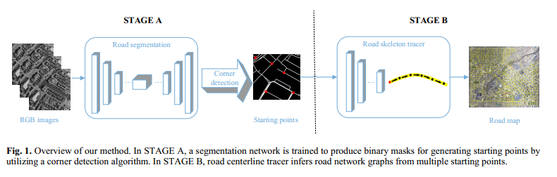
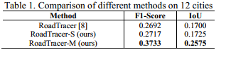

# RoadTracer-M

This repository is the official implementation of [ROAD NETWORK EXTRACTION FROM SATELLITE IMAGES USING CNN BASED SEGMENTATION AND TRACING](https://ieeexplore.ieee.org/abstract/document/8898565).  It aims at tracking the road centerline from multiple starting points in satellite images.

## Pipeline 



## Results




## Requirements

To install requirements:

```setup
pip install -r requirements.txt
```

For generating the **dataset**, please refer to [RoadTracer](https://github.com/mitroadmaps/roadtracer) for more details.

## Structure

- **Corner/corner_detection.py** : generating the starting points for further road tracing.
- **Tracer/**: tracing the road centerline from these starting points. Some of them are modified from [RoadTracer](https://github.com/mitroadmaps/roadtracer).

## Training

To train the model(s) in the paper, run this command:

```train
python train.py --input-data <path_to_data> --alpha 10 --beta 20
```

>📋  Describe how to train the models, with example commands on how to train the models in your paper, including the full training procedure and appropriate hyperparameters.


## Contributing

- [yao WEI](https://github.com/weiyao1996)
- [kai ZHANG](https://github.com/SummerOf15)


## Citation

If you find our work useful in your research, please cite:

```
  @INPROCEEDINGS{8898565,
  author={Wei, Yao and Zhang, Kai and Ji, Shunping},
  title={Road Network Extraction from Satellite Images Using CNN Based Segmentation and Tracing}, 
  booktitle={IGARSS 2019 - 2019 IEEE International Geoscience and Remote Sensing Symposium}, 
  year={2019},
  pages={3923-3926}
  }
```
